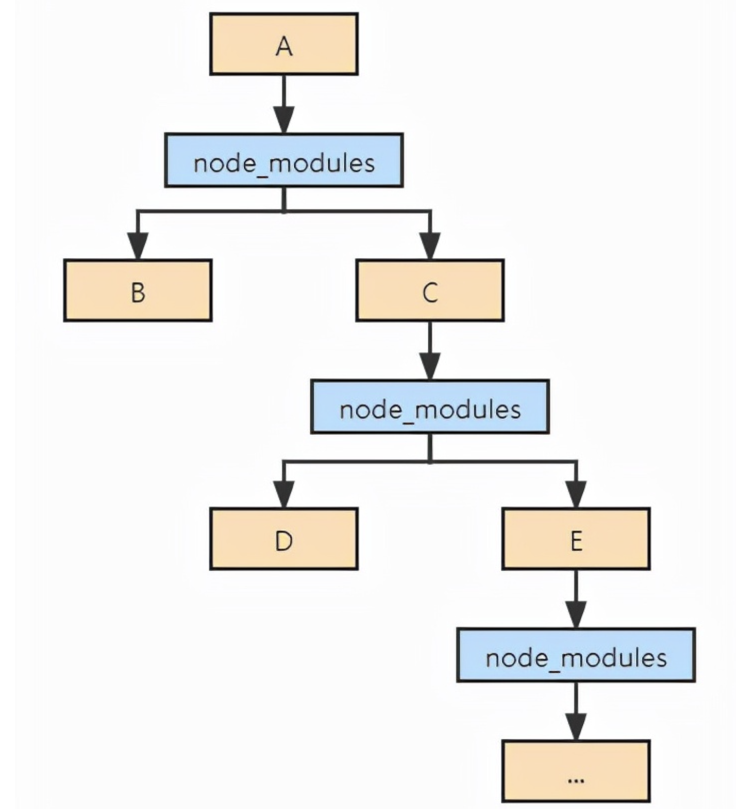
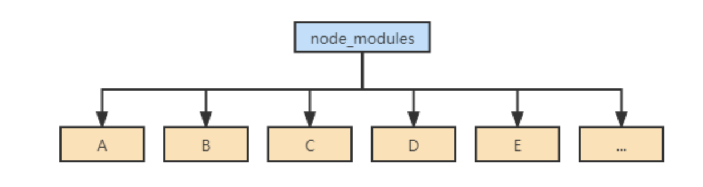
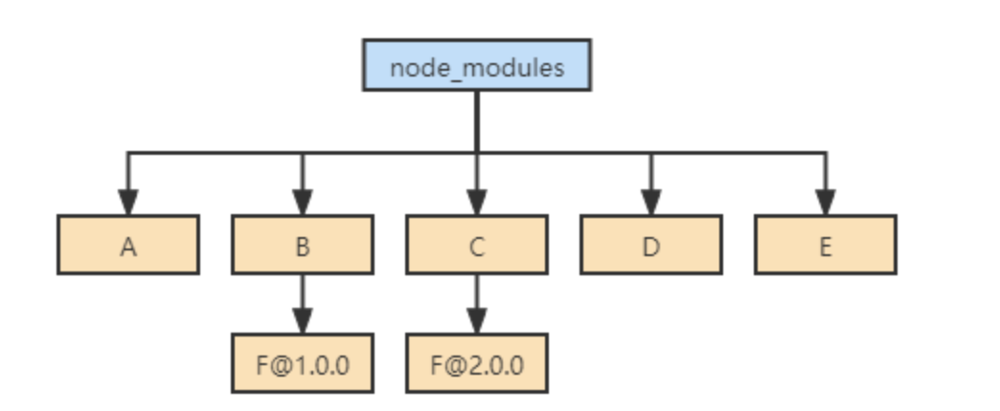
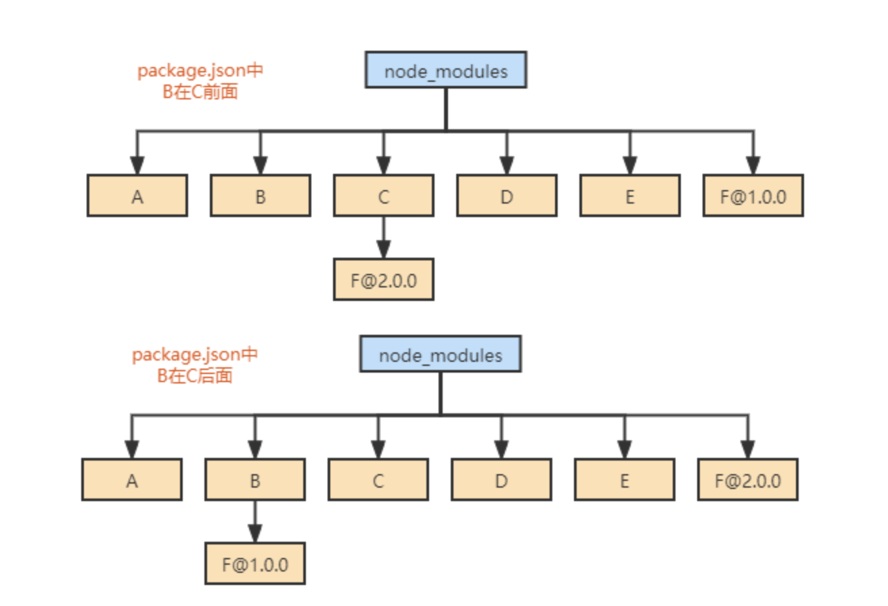

# npm & yarn
## npm1/2
- 原理
    - 执行命令后，首先会构建依赖树，然后针对每个节点下的包，会经历下面四个步骤:
        - 将依赖包的版本区间解析为某个具体的版本号；
        - 下载对应版本依赖的 tar 包到本地离线镜像；
        - 将依赖从离线镜像解压到本地缓存；
        - 将依赖从缓存拷贝到当前目录的 node_modules 目录；
    - 然后，对应的包就会到达项目的node_modules当中。
    
- 问题
    - 嵌套层次太深
    - 包重复安装
    - 模块实例无法共享，导致一些无法预知的bug
## npm3/yarn
- 亮点
    - 通过扁平化依赖的方式来解决上面3个问题
    
- 思路
    - 所有的依赖都被拍平到node_modules目录下，不再有很深层次的嵌套关系
    - 样在安装新的包时，根据 node require 机制，会不停往上级的node_modules当中去找，如果找到相同版本的包就不会重新安装，解决了大量包重复安装的问题，而且依赖层级也不会太深
- 问题
    - package.json中未定义的包也可以直接使用
    `
    package.json 中我们只声明了A，B ~ F都是因为扁平化处理才放到和A同级的 node_modules 下，理论上在项目中写代码时只可以使用A，但实际上B ~ F也可以使用，由于扁平化将没有直接依赖的包提升到 node_modules 一级目录，Node.js没有校验是否有直接依赖，所以项目中可以非法访问没有声明过依赖的包。
    `
    - node_modules安装的不稳定性
    `比如B和C都依赖了F，但是依赖的F版本不一样：`
    
    `依赖结构的不确定性表现是扁平化的结果不确定，以下2种情况都有可能，取决于package.json中B和C的位置。`
    
    - 平铺式的node_modules算法复杂，耗费时间, 要判断查找安装等操作
## npm5.x/yarn
- 亮点
    - 该版本引入了一个lock文件，以解决node_modules安装中的不确定因素
    - 这使得无论你安装多少次，都能有一个一样结构的node_modules
    - 这也是为什么lock文件应该始终包含在版本控制中并且不应该手动编辑的原因。
