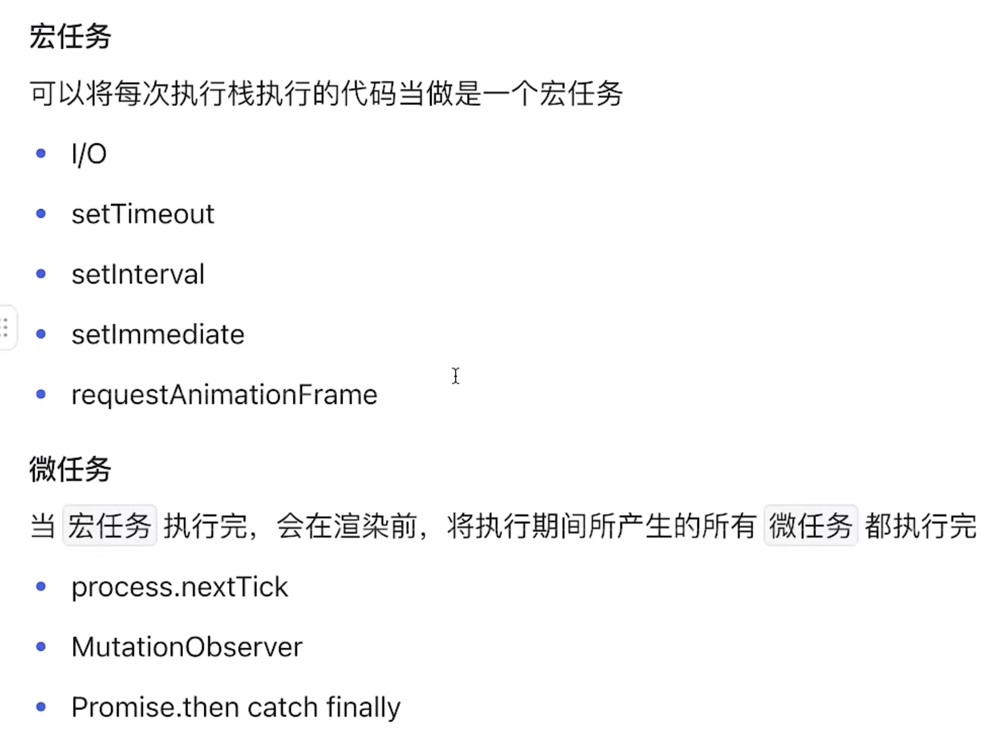
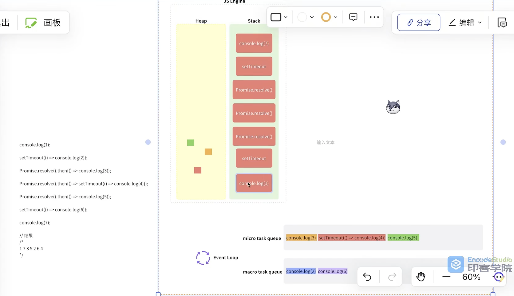

# 事件循环
- 异步任务


- 示例示意图


- 算法题
```js
console.log('[1]');
setTimeout(() => console.log(`[2]`), 0);
setTimeout(() => console.log(`[3]`), 1);

const p = Promise.resolve();
for(let i = 0; i < 3; ++i) {
    p.then(() => {
        setTimeout(() => {
            console.log(`[4]`);
            setTimeout(() => console.log(`[5]`));
            p.then(() => console.log(`[6]`));
        }, 0);
    })
    console.log(`[7]`);
}
console.log(`[8]`);
```
`
[1]
[7]
[7]
[7]
[8]
[2]
[3]
[4]
[6]
[4]
[6]
[4]
[6]
[5]
[5]
[5]


主线程: 4
微任务: 6
其他任务: 4 4 5

`