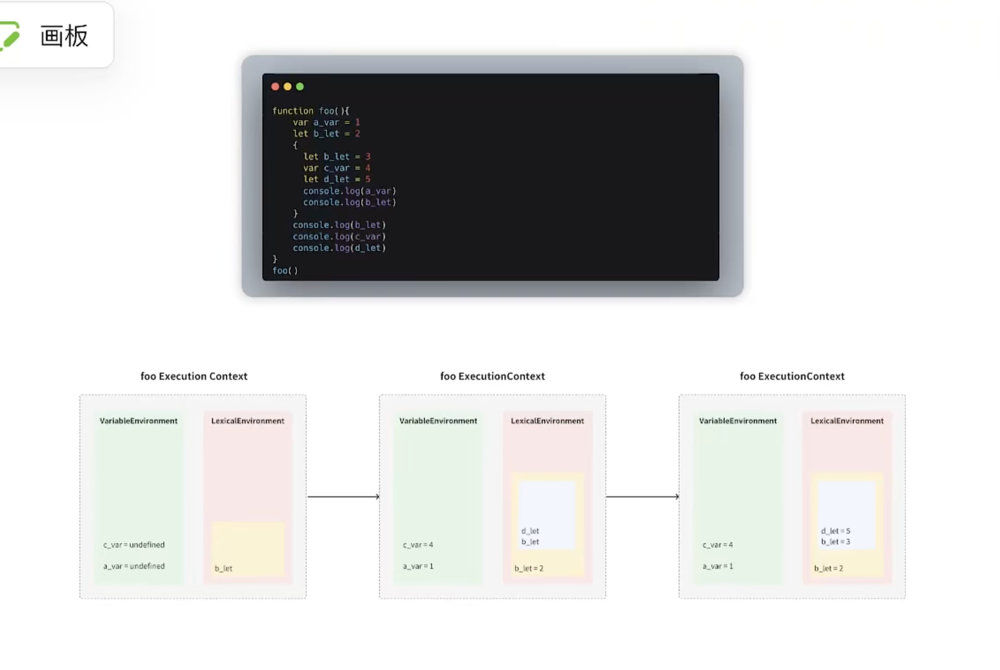

# 执行上下文
- 概念
    - 函数或者其他内容在执行过程中都是需要分配存储空间的，此时有一个对象来表示当前的执行上下文
    - 执行上下文里面在分为针对普通变量var等通过variable enronment进行存储
    - 若是let const等变量通过词法环境进行存储
- let var const
    - 初始化是，var 的变量默认赋值为undefined，
    let const 则不会设置默认值，nothing

